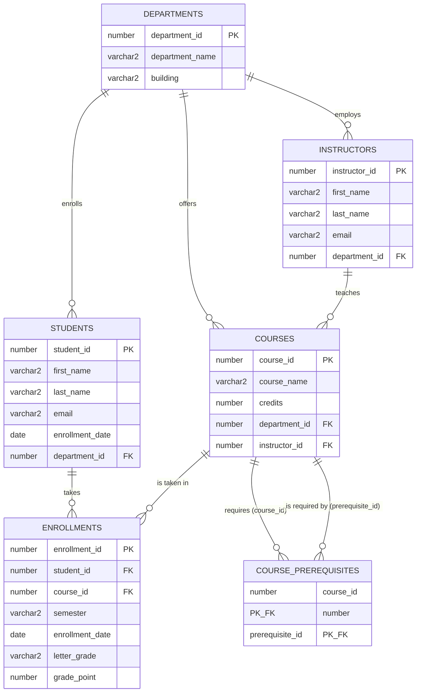

# Student Information System — CTEs & SQL Window Functions Project


** 
**Course:** Database Programming
**Instructor:** Eric Maniraguha
**Group Members Reg Numbers:** 30713/2025||27860/2024||28873/2025

---

## 1. Business Problem

The university registrar currently tracks student enrollment, course history,
and grades across scattered spreadsheets. There is no single system that can
answer questions like:

- Which students are enrolled in which courses, and what did they score?
- Which courses require other courses to be completed first, and what is the
  full prerequisite chain for a given course?
- How is academic performance trending for an individual student over time?
- Which departments are the most academically active, and which courses are
  the hardest based on average grades?

This project designs a small **Student Information System (SIS)** relational
database and uses **Common Table Expressions (CTEs)** and **SQL Window
Functions** to answer these questions directly in SQL.

---

## 2. Database Schema

| Table | Purpose |
|---|---|
| `DEPARTMENTS` | Academic departments (Computer Science, Business, etc.) |
| `INSTRUCTORS` | Faculty members, each belonging to one department |
| `STUDENTS` | Enrolled students, each with a home department |
| `COURSES` | Courses offered by a department and taught by an instructor |
| `COURSE_PREREQUISITES` | Self-referencing table: which courses require which other courses first |
| `ENROLLMENTS` | Fact table linking a student, a course, a semester, and a grade |

Primary keys and foreign keys are defined in
[`sql/01_create_tables.sql`](sql/01_create_tables.sql).

---

## 3. ER Diagram



> GitHub renders this Mermaid diagram automatically. If you also took a
> screenshot of the diagram from SQL Developer's "Display Diagram" feature,
> add it to `er-diagram/` and link it here as well.

---

## 4. CTE Implementations

All queries live in [`sql/03_cte_examples.sql`](sql/03_cte_examples.sql).

### 4.1 Simple CTE
Builds a clean student directory joined to department name.
**Business value:** removes the need to repeat the department join logic
anywhere a student list is needed.

### 4.2 Multiple CTEs
Two independent CTEs (student counts per department, course counts per
department) are combined in one final query.
**Business value:** gives the registrar a one-glance departmental workload
summary.

### 4.3 Recursive CTE
Walks the `COURSE_PREREQUISITES` self-referencing table to find the *entire*
prerequisite chain for "Web Application Development", not just its direct
prerequisites.
**Business value:** lets advisors tell a student every course they must
complete, in order, before they can register for a target course.

### 4.4 CTE with Aggregation
Aggregates GPA statistics (average, min, max) per course.
**Business value:** flags unusually difficult or unusually easy courses for
curriculum review.

### 4.5 CTE Combined with JOIN
Joins enrollment, student, and course data to rank departments by total
credit-hours completed.
**Business value:** identifies the most academically active departments for
resource planning.

*(Add your screenshot under each numbered heading above once you run the
script in SQL Developer — see the Setup Guide.)*

---

## 5. Window Function Implementations

All queries live in [`sql/04_window_functions.sql`](sql/04_window_functions.sql).

### 5.1 Ranking Functions — `ROW_NUMBER()`, `RANK()`, `DENSE_RANK()`, `PERCENT_RANK()`
Ranks students within each course by GPA, showing how the four functions
handle ties differently.
**Interpretation:** `RANK()` leaves gaps after a tie (1, 1, 3), `DENSE_RANK()`
does not (1, 1, 2), and `PERCENT_RANK()` expresses the same ranking as a
0–1 percentile.

### 5.2 Aggregate Window Functions — `SUM()`, `AVG()`, `MIN()`, `MAX() OVER()`
Shows each enrollment row next to that course's overall average, minimum,
maximum, and running total GPA, without collapsing rows.
**Interpretation:** makes it easy to see at a glance whether a single
student scored above or below the course average.

### 5.3 Navigation Functions — `LAG()`, `LEAD()`
Compares each student's GPA in a given semester to their previous and next
semester's GPA.
**Interpretation:** a positive `gpa_change` means the student improved;
negative means they declined — useful for early academic-advising alerts.

### 5.4 Distribution Functions — `NTILE()`, `CUME_DIST()`
Splits students into four performance quartiles by overall average GPA and
shows their cumulative percentile.
**Interpretation:** quartile 1 is the top-performing 25% of students
(Dean's List candidates); the cumulative percentile shows exactly where a
student sits relative to their peers.

*(Add your screenshot under each numbered heading above once you run the
script in SQL Developer.)*

---

## 6. Analysis and Findings

### Descriptive Analysis — What happened?
Grades and enrollment history show that most students maintain a GPA
between 3.0 and 4.0, with Computer Science students taking the highest
number of connected courses (Introduction to Programming feeds into three
other courses).

### Diagnostic Analysis — Why did it happen?
Courses with lower average GPA tend to be the ones with the most
prerequisites stacked before them, suggesting difficulty increases as
students move deeper into a course sequence.

### Prescriptive Analysis — What actions should be taken?
- Advisors should use the recursive prerequisite query to plan multi-semester
  schedules for students before registration opens.
- Departments with declining `LAG()`/`LEAD()` trends for a student should
  trigger an academic-advising check-in.
- Courses with the lowest `avg_gpa` from the aggregation CTE should be
  reviewed for pacing or additional support resources.

---

## 7. References

- Oracle Database SQL Language Reference — Common Table Expressions and
  Window Functions.
- Course material for C11665 - DPR400210: Database Programming, University
  of Lay Adventists of Kigali.

---

## 8. Academic Integrity Statement

This project, including its database design, SQL scripts, and analysis, is
my own original work, completed for the C11665 - DPR400210 Database
Programming assignment. No part of it was copied from a classmate or from
an online repository without attribution.

---

## 9. Repository Contents

```
.
├── README.md
├── sql/
│   ├── 01_create_tables.sql
│   ├── 02_insert_data.sql
│   ├── 03_cte_examples.sql
│   └── 04_window_functions.sql
├── er-diagram/
│   └── (optional exported ER diagram image)
├── screenshots/
│   └── (query result screenshots go here)
└── SETUP_GUIDE.md
```

See [`SETUP_GUIDE.md`](SETUP_GUIDE.md) for the exact step-by-step process
used to build and run this project, and to publish it to GitHub.
